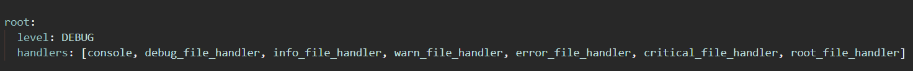

# Upgrade your print statements
<p>

<p>


Logging does exactly what print statements do except better. They include [loads of other metadata](https://docs.python.org/3/library/logging.html#logrecord-attributes) like:

* timestamp
* args (values or variables put into functions)
* Function name
* level (e.g. DEBUG)
* line number (e.g line 42)
* msg (same as print!)
* module (which python script it came from)
* processes (getting fancy)
* threads (getting very fancy)

## Ok so how do I get started?

All of the nasty logging configuration has been done already in `logconfig/` folder.<br />
There is also a timing decorator in `utils/` so you can optimize your code just by putting `@timing` above your function.
<br /><br />
Now to see loggers in action, setup a virtual environment and then run `main.py`

## Requirements

 * Python 3.7+

<sup>I haven't tried any earlier version</sup>
## Quickstart - Windows using powershell or CMD

cd to clone directory. Create virtual env with pip + venv:

```powershell
git clone https://github.com/izzley/loggerexamples
cd loggerexample\
py -0p # Optional: check your version and path.
py -m venv .venv
.venv\Scripts\activate
pip install --upgrade pip
pip install -r requirements.txt

# run main script
.\src\main.py
```

For SSL certificate errors to pypi.org you can include options to trust (PyYaml is the only package we need and it is trustworthy).

```
pip install --trusted-host pypi.org --trusted-host files.pythonhosted.org -upgrade pip
pip install --trusted-host pypi.org --trusted-host files.pythonhosted.org -r requirements.txt
```

## Quickstart - Linux/Mac

```sh
cd /to/clone/location
git clone https://github.com/mottmacdonaldglobal/PowerBI_git
cd /PowerBI_git/
python3 -m venv .venv
source .venv/bin/activate
pip install --upgrade pip
pip install -r requirements.txt
```

If your relative imports aren't working, create `.pth' and add the 
parent folder/s to the file:

```
$ echo $(pwd) >> .venv/lib/python3.8/site-packages/my_p_ext.pth
```


<details><summary><b>
Whats in the YAML file??
</b></summary>

In short, all of the instructions for how the logger should behave.
### formatters


```json
formatters:
  standard:
    format: "%(asctime)s %(levelname)s - [%(filename)s: line %(lineno)s] - %(funcName)s - %(message)s"
```

Take this logger for example:
```{python}
def funccalc(n):
    logger.debug("something executed")
    for _ in range(n):
        i = 0
    return
```

```bash
2021-11-21 15:43:47,689 DEBUG - [module01.py: line 17] - funccalc - another thing
```


### loggers

```json
root:
  level: DEBUG
  handlers: [console, debug_file_handler, info_file_handler, warn_file_handler, error_file_handler, critical_file_handler, root_file_handler]
```

<p align="center">
  
</p>

### handlers

### filters


## References

- https://zetcode.com/python/logging/