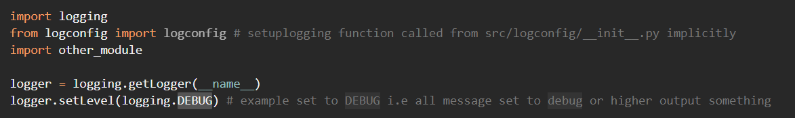

# Upgrade your print statements

<p align="centre">

</p>


## Loggers are like print() statements
except they also include [loads of other metadata](https://docs.python.org/3/library/logging.html#logrecord-attributes):

* timestamp
* msg (same as print!)
* args (values or variables put into functions)
* function name
* level (e.g. DEBUG)
* line number (e.g line 42)
* module (which python script it came from)
* processes (getting fancy)
* threads (getting very fancy)

<p> 

</p>


## I want it all WITHOUT CONFIGURATION!
No problems. Go to [LOGURU](https://github.com/Delgan/loguru/blob/master/LICENSE)!<br />
You can pretty much run with minimal config and loads of features. It has all the features of this repo and more, along with a badass logo.


## Where do I start?

This repo comes bundled with tidy logging configuration files saved in `src/logconfig/`.<br />
There is also a timing decorator in `src/utils/` so you can optimize your code by simply decorating your function with `@timing` above it. There are many online articles but very few clearly explain how to configure complex loggers with filters and yaml files. 
<br />
To see loggers in action, setup a virtual environment and then run `src/mainmodule.py`

## Requirements

 * Python 3.6+

<sup>(Feel free to submit earlier versions that work)</sup>

## Quickstart - Git clone and virtual env setup

<details>
<summary>Quickstart Instructions</summary>

--- 
<br>

## Windows using powershell or CMD

cd to clone directory. Create virtual env with pip + venv:

```powershell
git clone https://github.com/izzley/loggerexamples
cd loggerexamples\
py -0p # Optional: check your version and python path
py -m venv .venv
.venv\Scripts\activate
pip install --upgrade pip
pip install -r requirements.txt

# run main script
.\src\main.py
```

## Linux/Mac

```sh
cd /to/clone/location
git clone https://github.com/izzley/loggerexamples
cd loggerexamples/
python3 -m venv .venv
source .venv/bin/activate
pip install --upgrade pip
pip install -r requirements.txt
```

If your relative imports aren't working, create `.pth' and add the 
parent folder/s to the file:

```
$ echo $(pwd) >> .venv/lib/python3.8/site-packages/my_p_ext.pth
```

</details>

## Play with the logger

<details>
<summary>Walkthroughs</summary>

--- 
<br>

@TODO add list of suggestions to inspect
### Try changing the __main__ logger level from `main_module.py`
The __main__ logger is first setup from `main_module.py`.
Notice how the level is set to `DEBUG`?<br> 
<p align="centre">

</p> <br> 

* Run `main_module.py` with this DEBUG setting and take a look at `src/logconfig/root.log`.<br>
* Now change the level to `WARNING` and spot the difference in `src/logconfig/root.log`. This logger is the `__main__` logger. Notice any changes?<br> 
<p align="centre">

</p>  <br> 

* Notice everything from `__main__` is greater or equal to `WARNING`? Some `INFO` logs still show because their levels weren't changed. Go ahead and change the loglevel in `other_module.py` to `CRITICAL` and spot the difference.

</details>
<br>

## Whats in the YAML file??

<details>
<summary>YAML parts</summary>

--- 
<br>

In short, the `conf.YAML` file contains all of the instructions for how the logger should behave. Below breaks down the conf yaml file into its parts:
### formatters


```json
formatters:
    standard:
        format: "%(asctime)s %(levelname)s - [%(filename)s: line %(lineno)s] - %(funcName)s - %(message)s"
```

Take this logger for example:
```{python}
def funccalc(n):
    logger.debug("something executed")
    for _ in range(n):
        i = 0
    return
```

The output reflects the yaml file format settings:

```bash
2021-11-21 15:43:47,689 DEBUG - [module01.py: line 17] - funccalc - something executed
```


### loggers
@TODO describe root loggers and their inheritance
```json
root:
  level: DEBUG
  handlers: [console, debug_file_handler, info_file_handler, warn_file_handler, error_file_handler, critical_file_handler, root_file_handler]
```

<p align="center">
  
</p>

### handlers
@TODO describe handlers and how they redirect bytes

### filters
@TODO describe how filters only allow bytes to handlers if a condition is true. reference filter classes in logconfig.py


</details>

## References
* Docs: https://docs.python.org/3/library/logging.html#module-logging
* lots of logging examples: https://zetcode.com/python/logging/
* filters explained: https://gist.github.com/kingspp/9451566a5555fb022215ca2b7b802f19
* timeit vs decorator: https://stackoverflow.com/questions/1622943/timeit-versus-timing-decorator
* real python uses perf_counter: https://realpython.com/lessons/timing-functions-decorators/
* What are decorators: https://gist.github.com/Zearin/2f40b7b9cfc51132851a
* Decorators can be reinforced to accept args: https://stackoverflow.com/questions/653368/how-to-create-a-python-decorator-that-can-be-used-either-with-or-without-paramet

